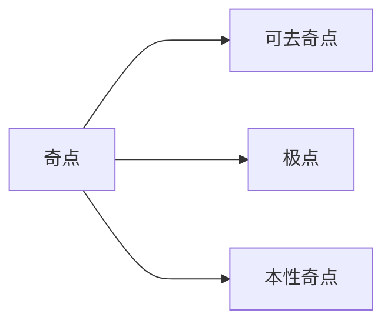

## 零点

$z=z_{0}$ 是 $f(z)$ 的 $m$ 阶零点 $\Leftrightarrow$
$$
f(z)=(z-z_{0})^{m}\varphi(z)
$$
其中
- $\varphi(z)$ 在邻域 $N(z_{0},\delta)$ 解析
- $\varphi(z_{0})\ne 0$

## 奇点

| 奇点类型    | 洛朗级数特征      | 极限特征                              |
| ------- | ----------- | --------------------------------- |
| 可去奇点    | 无负数幂        | $\lim_{ z \to z_{0} }f(z)=c$      |
| $m$ 阶极点 | 有最高 $-m$ 次幂 | $\lim_{ z \to z_{0} }f(z)=\infty$ |
| 本性奇点    | 有无穷负次幂      | $\lim_{ z \to z_{0} }f(z)$ 不存在    |
### 极点

#### 洛朗形式

$z=z_{0}$ 是 $f(z)$ 的 $m$ 阶极点 $\Leftrightarrow$
$$
f(z)=a_{-m}(z-z_{0})^{-m} + \dots + a_{0} + a_{1}(z-z_{0}) + \dots + z_{n}(z-z_{0})^{n}
$$

#### 因式形式

$z=z_{0}$ 是 $f(z)$ 的 $m$ 阶极点 $\Leftrightarrow$
$$f(z)=\frac{1}{(z-z_{0})^{m}}g(z)$$
其中
- $g(z)$ 在 $N(z_{0}, \delta)$ 解析
- $g(z_{0})\ne0$

>[!warning] 因式形式の隐晦性
>不能直接根据因式形式の表面形式判断极点阶数
>e.g. $$f(z)=\frac{\cos z - 1}{z^{4}}$$ 的极点 $z=0$ 并非 4 阶而是 2 阶
>原因如下
>1. $g(z)=1-\cos z$ 不满足 $g(0)\ne 0$
>2. 由于$$\begin{align} f(z)  & = z^{-4} \left( 1 - \frac{z^{2}}{2!} + \frac{z^{4}}{4!} + \dots - 1  \right) \\  & = -\frac{1}{2!}z^{-2} + \frac{1}{4!} - \dots \end{align}$$ 所以实际上 $z=0$ 是 2 阶极点

#### 零极关系

$z_{0}$ 是 $\frac{1}{f(z)}$ 的 $m$ 阶零点 $\Leftrightarrow$ $z_{0}$ 是 $f(z)$ 的 $m$ 阶极点

### 孤立奇点

1. 【定义法】$z=z_{0}$ 在邻域 $\lim_{ \delta \to 0 }N(z_{0},\delta)$ 不存在其他极点
2. 【极限法】$z=z_{0}$ 是解析函数 $f(z)$ 的一个奇点序列的极限

>[!example] 非孤立奇点の例子
>考虑 $$f(z)=\sin\frac{\pi}{z}$$
>易得 $z=0$ 是 $f(z)$ 一个奇点
>又 $f(z)$ 存在极点序列 $z_{k}=\frac{1}{k}$
>其极限为 $\lim_{ k \to \infty }\frac{1}{k}=0$
>所以 $z=0$ 是 $f(z)$ 的**非孤立奇点**

### 无穷孤立奇点

若 $z=\infty$ 是 $f(z)$ 的孤立奇点，则 $f(z)$ 有无穷孤立奇点

判断无穷孤立奇点の阶数：
1. 令 $\zeta=\frac{1}{z}$
2. 研究 $f(\frac{1}{\zeta})$ 在 $\zeta = 0$ 的奇点阶数
3. 即为无穷孤立奇点阶数
