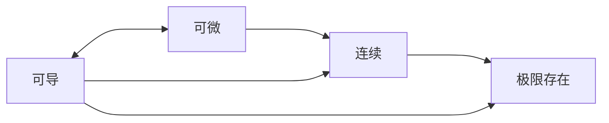
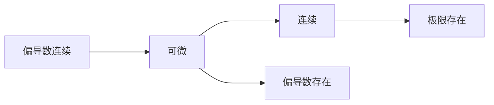

## 关系

%20(Z-Library).pdf.md#page228andrect37233450328andcolornote)

>[!info] 约定
>有箭头代表 tail 可以推出 head
>没有箭头代表互相不一定可以推出对方
### 一元

### 多元

## 计算

1. **定点的偏导数**：带入其他变量后再用极限求。 $$ f'_x(0,0)=\lim_{x\to 0}{\frac{f(x,0)-f(0,0)}{x}} $$
2. **判断在某点是否可微**：
	+ 全微分连续 (偏导一定是所求点的偏导值，而不是偏导函数)：$$ \lim_{\Delta x \to 0, \Delta y \to 0}{\frac{\Delta z - f'_x(P_{0}) \cdot \Delta x - f'_y(P_{0}) \cdot \Delta y}{\sqrt{(\Delta x)^2 + (\Delta y)^2}}} = 0$$
	+ 偏导数连续
		**对于初等函数，偏导数存在就一定可微，但不一定偏导数连续**
		比如 $(x^2+y^2)\sin \frac{1}{\sqrt{ x^2+y^2 }}$ 在原点处就偏导数存在，可微。但是他在原点的偏导数不连续。
		而且注意一定是初等函数，分段函数就不能看做初等！！
			e.g. $f(x,y)=\left\{ \begin{align} & \frac{\left|xy\right|^{\frac{3}{2}}}{x^2+y^2} & (x,y)\neq(0,0) \\ & 0 & (x,y)=(0,0) \end{align} \right.$ 就不能看做初等函数，连续性和偏导数存在性不等同。

3. **多元函数微分**：$d(f(x_{1},\dots,x_{n}))=\sum_{i=1}^{n} \frac{\partial f}{\partial x_{i}}\,dx_{i}$

