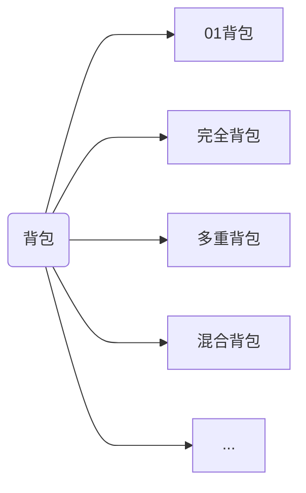

>[!info] 约定
> 第 $i$ 件物品具有价值 `v[i]`  和重量 `w[i]`
> 
> 背包容量为 `W`

## 01 背包

每种物品只能被放入背包 1 次

### 朴素实现

设计状态 `f[i][j]`
- `i` $\Rightarrow$ 只考虑第 $1$ ~ $i$ 件物品的子问题
- `j` $\Rightarrow$ 剩余容量
- `f` $\Rightarrow$ 该子问题的答案 aka 最大价值

状态转移有两个分支
- 不选当前物品 $\Rightarrow$ 容量不变，价值不变
- 选择当前物品 $\Rightarrow$ 容量减少 `w[i]`，价值增加 `v[i]`

```cpp
f[i][j] = max(f[i - 1][j], f[i][j - w[i]] + v[i])
```

### 滚动优化

因为 `f[i][j]` 的 `[i]` 维度只有 `[i - 1]` 能影响 `[i]`

所以可以不断让 `f[i]` 覆盖在原来 `f[i - 1]` 的内存上 aka 滚动数组

状态转移方程如下

```cpp
f[j] = max(f[j], f[j - w[i]] + v[i])
```

>[!note] 板子·01背包·滚动优化实现
>```cpp
>for (int i = 1; i <= n; ++i)
>	for (int j = W; j >= w[i]; --j)
>		f[j] = std::max(f[j], f[j - w[i]] + v[i]);
>```
>时间复杂度 $O(W)$
>空间复杂度 $O(W)$

>[!warning] 错误实现
>```cpp
>for (int i = 1; i <= n; ++i)
>	for (int j = w[i]; j <= W; ++j) //! BOOM!
>		f[j] = std::max(f[j], f[j - w[i]] + v[i]);
>```
>实际上这是[完全背包](%E8%83%8C%E5%8C%85dp.md#)的解决方法
>
>因为当 `j >= w[i]` 时，`f[i][j]` 会被 `f[i][j - w[i]]` 影响
>
>相当于物品 `i` 可以被放入无限次

## 完全背包

每种物品能被放入背包 $\infty$ 次

>[!note] 板子·完全背包实现
>
>```cpp
>for (int i = 1; i <= n; ++i)
>	for (int j = w[i]; j <= W; ++j)
>		f[j] = std::max(f[j], f[j - w[i]] + v[i]);
>```
>时间复杂度 $O(W)$
>空间复杂度 $O(W)$

## 多重背包

每种物品能被放入背包 $\leq$ `cnt[i]` 次

>[!note] 板子·多重背包·朴素实现
>```cpp
>for (int i = 1; i <= n; ++i)
>	for (int j = W; j >= w[i]; --j)
>		for (int k = 1; k * w[i] <= j && k <= cnt[i]; ++k)
>			f[j] = std::max(f[j], f[j - k * w[i]] + k * v[i]);
>```
>
>时间复杂度 $O\left( W\sum k_{{i}} \right)$

>[!warning] 多重背包错误实现
>先枚举剩余重量，后枚举个数 $\implies$ ✅
>先枚举个数，再枚举剩余重量 $\implies$ ❌

### 二进制分组优化

枚举 `cnt[i]` 时，复杂度是 $O(cnt[i])$

而如果把 `cnt[i]` 分拆成二进制数
并根据数位拆成不同的物品
再对这些物品进行 01 枚举
时间复杂度是 $O(\log_{2}cnt[i])$
总时间复杂度变为 $O\left( W\sum \log_{2}cnt[i] \right)$

>[!note] 板子·多重背包·二进制分组实现
>预处理
>```cpp
>std::forward_list< Object > a;
>for (int i = 1; i <= n; ++i) {
>	int w, v, k;
>	std::cin >> w >> v >> k;
>	int c = 1;
>	while(k > c) {
>		k -= c;
>		a.emplace_front(Object { w * c, v * c });
>		c *= 2;
>	}
>	a.emplace_front(Object { w * k, v * k });
>}
>```
>核心状态转移和[01 背包](%E8%83%8C%E5%8C%85dp.md#01) 一致

## 混合背包

$=$ [01 背包](%E8%83%8C%E5%8C%85dp.md#01) $+$ [完全背包](%E8%83%8C%E5%8C%85dp.md#) $+$ [多重背包](%E8%83%8C%E5%8C%85dp.md#)

每种物品能被放入背包 either
- 1 次
- `cnt[i]` 次
- $\infty$ 次

实现思路是枚举每个物品时，根据 物品的可放入次数 套用 相应的背包状态转移方程

```cpp
for (int i = 1; i <= n; ++i)
	if (cnt[i] == MAX) // 套用完全背包
		for (int j = w[i]; j <= W; ++j)
			f[j] = std::max(f[j], f[j - w[i]] + v[i]);
	else               // 套用多重背包, 同时可以解决 01 背包
		for (int j = W; j >= w[i]; --j)
			for (int k = 1; k * w[i] <= j && k <= cnt[i]; ++k)
				f[j] = std::max(f[j], f[j - k * w[i]] + k * v[i]);
```
