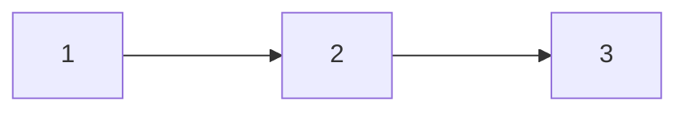
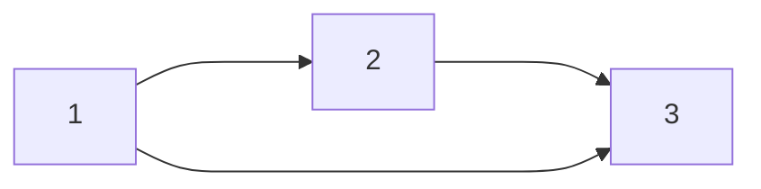

---
tags:
  - algorithm
  - 图论
title: 拓扑排序
date: 2024-11-30T17:50:57+08:00
lastmod: 2025-12-05T18:20:59+08:00
publish: true
---

## 栈实现

1. 入度为 0 的顶点入栈
2. 每轮栈顶弹出并输出，检测弹出导致入读为 0 的顶点，压入
3. 直到栈空，排序完成

时间复杂度
- 邻接表 $O(\lvert V \rvert+\lvert E \rvert)$
- 邻接矩阵 $O(\lvert V \rvert^{2})$ 

## DFS 实现
 
DFS 基本等价于栈，爆栈风险比用堆的 `std::stack` 大

## 队列实现

因为实际上拓扑排序都是尾递归，所以也可以用队列实现

## 坑点

1. 拓扑排序唯一 $\nRightarrow$ 图可以确定
	e.g. 下面两张图都满足拓扑排序唯一为 1 2 3

2. 拓扑排序方案数是[NP 问题](../../%E6%95%B0%E5%AD%A6/%E7%A6%BB%E6%95%A3%E6%95%B0%E5%AD%A6/%E9%9B%86%E5%90%88%E8%AE%BA/%E5%87%BD%E6%95%B0/NP%20%E9%97%AE%E9%A2%98.md)中的 P-完全问题，老老实实枚举吧
3. 拓扑排序实现是尾递归，即可以用栈也可以队列