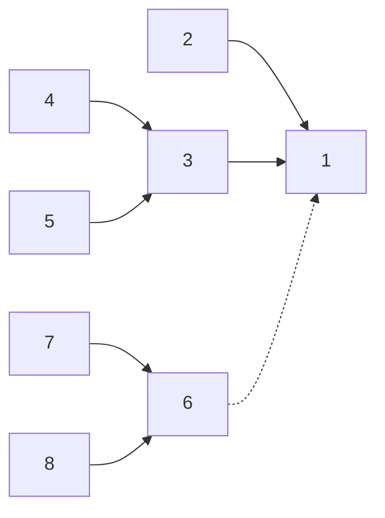

---
tags:
  - algorithm
  - 数据结构
dg-publish: "true"
title: 并查集
date: 2024-11-24T23:31:44+08:00
lastmod: 2024-12-04T17:19:59+08:00
publish: true
---
## 定义

树状结构，支持两种操作：

+ 合并
+ 查询：是否在同一集合

由于其查询功能，并查集常用于**检查图の连通性**。

> [!ATTENTION]
> 
> 注意有些题目使用 1~n 编号而不是 0 ~ n-1，图论问题都要注意编号问题，否则：
> + 数组越界访问 $\Rightarrow$ RE
> + 逻辑错误 $\Rightarrow$ WA

## 实现 | 无向图

### 结构

开数组池化避免 `new/delete` .

```cpp
struct Dsu {
	using ID = size_t;
	std::vector<ID> pa; // parent
	std::vector<size_t> size; // 启发式合并维护 size

	Dsu(size_t sz) : pa(sz), size(sz, 1) { 
		std::iota(pa.begin(), pa.end(), 0); // [^1] 
	}
};

// [^1]: Set parent as self, so that every node is a root.
```

### 查询

> [!note] 朴素做法
> 如下
> ```cpp
> auto Dsu::find(ID x) -> ID { return pa[x] == x ? x : find(pa[x]); }
> ```
> 
> 可以用路径压缩减少寻父次数到 1。

> [!note] 路径压缩
> 
> 即把树结构扁平化
> 
> 

```cpp
// with 路径压缩
auto Dsu::find(ID x) -> ID { return pa[x] == x ? x : pa[x] = find(pa[x]); }
```

> [!warning]
> 路径压缩一次可能会造成大量修改，并非 lazy。因此有时候路径压缩并不适合使用。例如：
> 
> + 可持久化并查集
> + 线段树分治 + 并查集
> 
> 这种情况一般使用**只包含启发式合并**的并查集

### 合并

只需将其中一个树的根接到另一个根上即可。



> [!note] 启发式合并
> **点数**/**深度**任选其一维护作为**估价函数**。
> 为了防止退化，降低复杂度，一般选择将节点少的根连到另一棵树
> 一般只使用路径压缩而不使用启发式合并，一般也不会超时，时间复杂度能达到 $O(m\alpha(m, n))$。
> 如果只使用启发式合并而不使用路径压缩，时间复杂度是 $O(m\log{n})$。因为路径压缩并不是什么时候都能用，所以这种情况也要考虑。
> 简而言之：
> + 路径压缩 + 启发式合并：$O(\alpha(n))$
> + 路径压缩 only：$O(m\alpha(m, n))$
> + 启发式合并 only: $O(m\log{n})$ 用于不能使用路径压缩时
> + 都不用：:LiCross:

```cpp
// with 启发式合并 维护点数
auto Dsu::unite(size_t x, size_t y) -> void {
	x = find(x);
	y = find(y);
	if (x == y) return;
	if (size[x] < size[y]) std::swap(x, y);
	pa[y] = x;
	size[x] += size[y];
}
```

### 删除

只能用于叶结点。

```cpp
auto Dsu::erase(ID x) -> void {
	size[find(x)]--;
	pa[x] = x;
}
```

可以为每个节点制作副本，将其副本作为父亲。

### 移动

只能用于叶结点。

```cpp
auto Dsu::move(ID from, ID to) -> void {
	auto pa_from = find(from);
	auto pa_to = find(to);
	if (pa_from == pa_to) return;
	size[pa_from]--;
	size[pa_to]++;
}
```


## 习题 TODO

- [ ] [P1525 [NOIP2010 提高组] 关押罪犯](https://www.luogu.com.cn/problem/P1525) (@2024-12-11) 📅 (due_date:: 2024-11-26) 

## 实现 | 有向图求最小环

### 结构

```cpp
struct Dsu {
	std::vector<size_t> pa;
	std::vector<size_t> dist; // 维护到祖先的距离

	Dsu(size_t n) : pa(n + 1), dist(n + 1, 0) { 
		std::iota(pa.begin(), pa.end(), 0); 
	}
};
```

### 查询

```cpp
auto Dsu::find(size_t x) -> size_t {
	if (x != pa[x]) {
		size_t last = pa[x];
		pa[x] = find(pa[x]);
		dist[x] += dist[last];
	}
	return pa[x];
}
```

### 合并

```cpp
size_t Dsu::min_ring_len = std::numeric_limits<size_t>::max();

auto Dsu::unite(size_t from, size_t to) -> void {
	auto f_from = find(from);
	auto f_to = find(to);
	if (f_from != f_to) {
		pa[f_to] = f_from;
		dist[to] = dist[from] + 1;
	} else {
		min_ring_len = std::min(min_ring_len, dist[from] + dist[to] + 1);
	}
}
```

## 实现 | 更多应用


```cardlink
url: https://oi-wiki.org/topic/dsu-app/
title: "并查集应用 - OI Wiki"
description: "OI Wiki 是一个编程竞赛知识整合站点，提供有趣又实用的编程竞赛知识以及其他有帮助的内容，帮助广大编程竞赛爱好者更快更深入地学习编程竞赛"
host: oi-wiki.org
favicon: ../../favicon.ico
```

