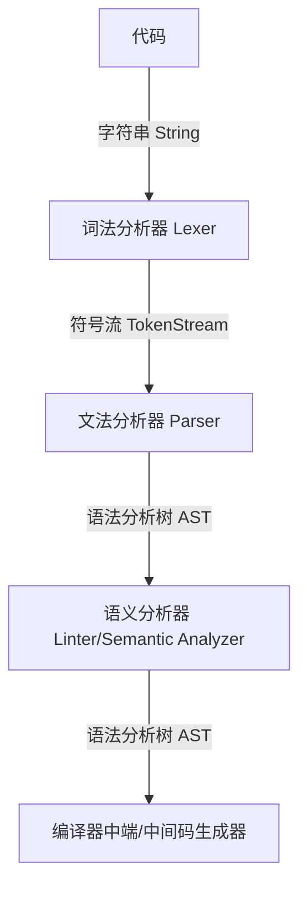

```mermaid
graph TD

CODE[代码]--->|字符串 String|LEXER[词法分析器 Lexer]
LEXER--->|符号流 TokenStream|PARSER[文法分析器 Parser]
PARSER--->|语法分析树 AST|LINTER[语义分析器 Linter/Semantic Analyzer]
LINTER--->|语法分析树 AST|编译器中端/中间码生成器
```

