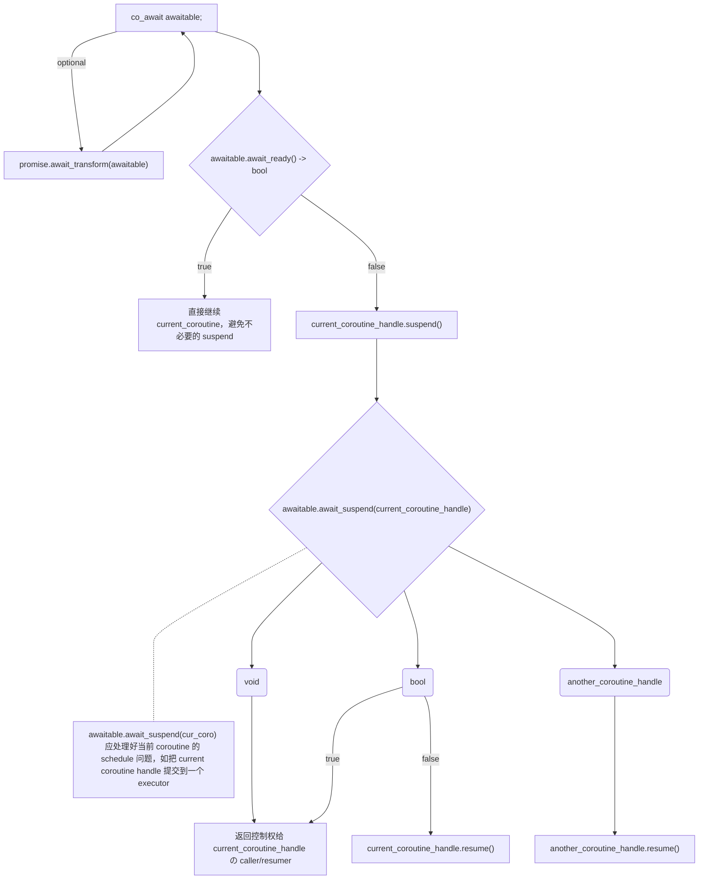

```cardlink
url: https://en.cppreference.com/w/cpp/language/coroutines
title: "Coroutines (C++20) - cppreference.com"
host: en.cppreference.com
```


```cardlink
url: https://www.bennyhuo.com/2022/03/06/cpp-coroutines-00-foreword/
title: "渡劫 C++ 协程"
host: www.bennyhuo.com
favicon: https://www.bennyhuo.com/assets/favicon-32x32.png
```

[【知乎】如何编写 C++ 20 协程(Coroutines)](https://zhuanlan.zhihu.com/p/355100152)

## 基本概念

### Coroutine

Coroutine $:=$ 含有 `co_return`/`co_await`/`co_yield` 的可暂停/唤醒的函数

### Coroutine State

包含
- Promise object
- 函数参数 (copy by value)
- 当前暂停点の局部变量
	local variables and temporaries whose lifetime spans the current suspension point.
- 当前暂停点の特征信息
	some representation of the current suspension point, so that a resume knows where to continue, and a destroy knows what local variables were in scope

### Coroutine Execution

[Coroutines (C++20) # Execution - cppreference.com](https://en.cppreference.com/w/cpp/language/coroutines#Execution)

>[!info]- 协程执行顺序文字版
>一个 coroutine 按以下顺序执行：
> 1. 调用 `operator new` 分配 coroutine state
> 2. `auto promise = return_type::promise_type{ /* ... */ };` 
> 	构造 Promise object 根据 `return_type::promise_type`
> 	- 优先选择**参数为函数参数**の构造函数
> 	- 如果没有，则选用默认构造函数
> 3. `internal_local_val = promise.get_return_object();`
> 4.  `return_object` 会在协程第一次暂停时返回给 caller
> 5.  exception 返回给 caller，promise 不保留 exception
> 6. `await promise.inital_suspend();` 
> 	- `-> suspend_never` : eager-started, 立刻开始
> 	- `-> suspend_always` : lazy-started, 等待主动调用 `coroutine_handle.resume()` 开始协程
> 7. 继续执行函数体
> 8. 遇到暂停点
> 9.  执行 [三大协程操作](coroutine%20%E5%88%9D%E8%AE%BA.md#) 中的两大 
> 10.  caller/resumer 得到 `static_cast<return_type>(return_object)`
> 11. 执行到 `co_return expr;`
> 12.  执行 `promise.return_xxx()`
> 	-   `decltype(expr) == void` $\to$ 执行 `promise.return_void()`
> 	-  `decltype(expr) != void` $\to$ 执行 `promise.return_value(expr)`
> 	-  `co_return;` $\to$ `promise.return_void()`
> 11.  raii 倒序析构
> 12. `promise.final_suspend();`
> 	- `-> suspend_never` : 立即销毁
> 	- `-> suspend_always` : 等待主动调用 `coroutine_handle.destroy()` 销毁协程

```cpp
auto __actual_coroutine(auto&&... args) -> Awaitable {
	[[internal]] auto __coroutine_state = new __InteralCoroutineState {};
	[[internal]] auto promise = Awaitable::promise_type { forward(args)... };
	[[internal]] auto return_object = promise.get_return_object();

	co_await promise.initial_suspend();
	// 无论上式是否暂停，这行 caller 会**立刻**收到 `return_object`.

	/* 原函数体 ... */

	// 假设这里是原函数体的一处暂停点
	// 这时发生:
	//   1. 执行 `co_await` 流程, 详见[[#co_await]].
	//   2. caller/resumer 收到控制权，不获得 return_object
	auto expr = co_await foo();

	/* 原函数体结束 (除了 `co_return`) */

	// co_return expr;
	promise.return_value(expr); // or `.return_void()` accordingly
	    // return_value(expr) 只改变 return_object，
	    // caller/resumer 不会直接收到 expr
	//! 自动存储变量在这行析构
	co_await promise.final_suspend();
}
```

>[!info]- uncaught exception in coroutine
>
> 如果有 uncaught exception，则执行：
> ```cpp
> promise.unhandled_exception();
> co_await promise.final_suspend();
> ```

>[!danger]- underfined behaviour 之 falling off end
>
>1. falling off end without `promise.return_void()` 定义
>```cpp
>template< typename T >
>struct Awaitable { 
>	/* no void return_void() { ... } */ 
>};
>
>auto foo() -> Awaitable< int > {
>	// ... coroutine op without co_return
>	// ub
>}
>```
>2. falling off end with return_type not `void` and without co keyword
>- without co keyword $\to$ 不是协程，无论 return_type 是不是 Awaitable
>- falling off end with return_type not `void` $\to$ 普通函数的 ub
>```cpp
>auto foo() -> Awaitable {
>	// no co_return/co_await/co_yield
>	// no return
>}
>```

>[!danger]- dangling reference 之 协程 copy by value 传引用
> 
> todo

### 约束与类型

#### Awaitable

```
Awaitable := Concept
	type promise_type
	requires .await_ready() -> bool
	requires .await_suspend(std::coroutine_handle) \
		-> void/bool/std::coroutine_handle
	requires .await_resume() -> void

std::suspend_never := Awaitable
	.await_ready() { return true; }
	.await_suspend() {}
	.await_resume() {}

std::suspend_always := Awaitable
	.await_ready() { return false; }
	.await_suspend() {}
	.await_resume() {}
```

#### Promise

```
Promise := Concept
	requires .initial_suspend() -> Awaitable
	requires .final_suspend() -> Awaitable
	requires .get_return_object() -> Awaitable
	requires when support `co_yield`
		 .yield_value() -> Awaitable
	requires .unhandled_exception() -> void
	requires either
		.return_value(T) -> void
		.return_void() -> void
	optional .await_transform(T expr) -> Awaitable
	optional .operator co_await()
```

#### Coroutine Handle

```
coroutine_handle<Promise> := Class
	.operator bool()      // valid
	.done()               // done
	.resume()             // === .operator()
	.promise()            // handle  -> promise
	static from_promise() // promise -> handle
	.address()
	static from_address()
	// ...
```

### 三大协程操作

#### co_return

相当于协程的 `return`。

协程完成所有 execution，除了 `promise.final_suspend()` 不再 suspend。

#### co_await

[co_await wording](https://en.cppreference.com/w/cpp/language/coroutines#co_await)



#### co_yield

[co_yield wording](https://en.cppreference.com/w/cpp/language/coroutines#co_yield)

```cpp
co_yield expr;
```

等价于

```cpp
co_await promise.yield_value(expr);
```

## 动态分配

C++ coroutine 作为无栈协程，默认使用 heap allocation (`operator new/delete`)

相比 static alloc 会少内联优化机会，且无法在嵌入式环境工作

可以自定义 allocator 并重载 `operator new` 调用解决

