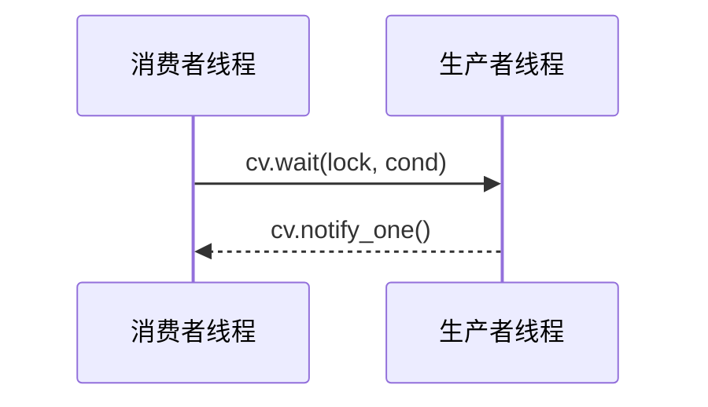

## 工作原理



## 核心用法

### .wait()

```cpp
template<typename Predicate>
void condition_variable::wait(std::unique_lcok<std::mutex>& lock, Predicate pred);
```

- `pred` 用来检查是否继续等待
- `lock` 用来保证 `pred` 所访问到的变量的线程安全

### .notify_one() 和 .notify_all()

顾名思义，提醒正在等待的 `condition_variable` 停止等待

## 假醒

aka. spurious wakeup

### 产生原因

`condition_variable` 实际上**依赖 OS 的具体实现**

而一般 OS 的条件变量实现设计，出于性能考虑，会出现即使没有 `notify` 也会停止等待的情况，叫做**假醒 Spurious Wakeup**

### 解决方法

只要加上谓词 `pred` 判断等待条件，就不会出现假醒

i.e. 
- `.wait(lock)` 行为不可预测，别用
- `.wait(lock, pred)` 总该使用
