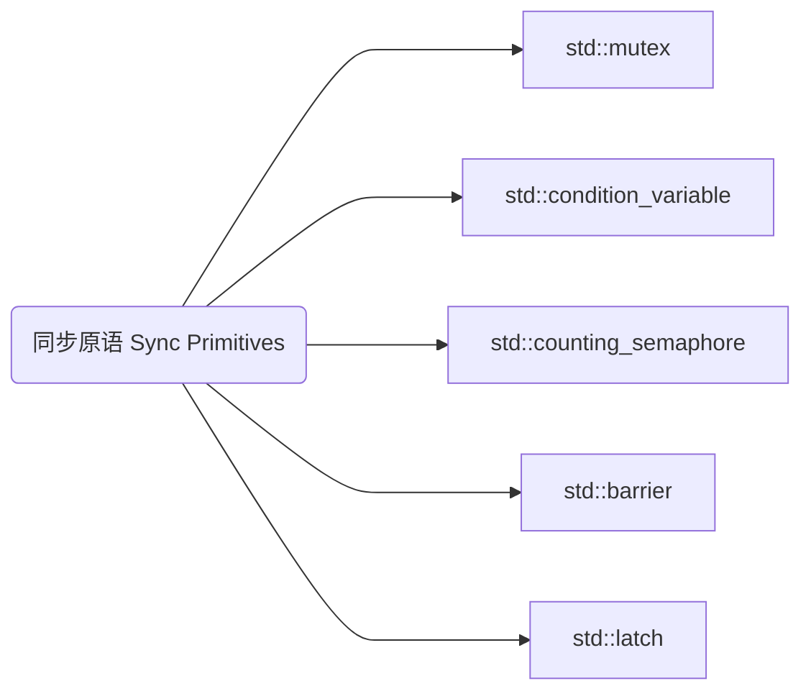

## mutex


## condition_variable


## semaphore

### counting_semaphore

```cpp
std::counting_semaphore<10> sem(5); // 最多允许10个线程同时访问，目前假设有5个访问
sem.acquire(); // 等待信号量
sem.release(); // 释放信号量
```

| **计数器值范围**          | `acquire()` 行为                     | `release()` 行为              |
| ------------------- | ---------------------------------- | --------------------------- |
| **`计数器 = 0`**       | **阻塞**直到新的 `release()`，<br>计数器不变=0 | 立即成功，<br>计数器+1              |
| **`0 < 计数器 < max`** | 立即成功，<br>计数器-1                     | 立即成功，<br>计数器+1              |
| **`计数器 = max`**     | 立即成功，<br>计数器-1                     | 计数器不变=max，<br>超出的增量会导致未定义行为 |

### binary_semaphore

相当于 `std::counting_semaphore<1>`

## latch

```cpp
std::latch completion_latch(3); // 等待3次计数
completion_latch.count_down();  // 减少计数
completion_latch.wait();        // 阻塞直到计数为0
```

## barrier

```cpp
std::barrier sync_point(4); // 等待4个线程到达
sync_point.arrive_and_wait(); // 线程在此同步
```

>[!note] C++20 同步原语总结
>
>`barrier` $\subseteq$ `latch` $\subseteq$ `semaphore` 

