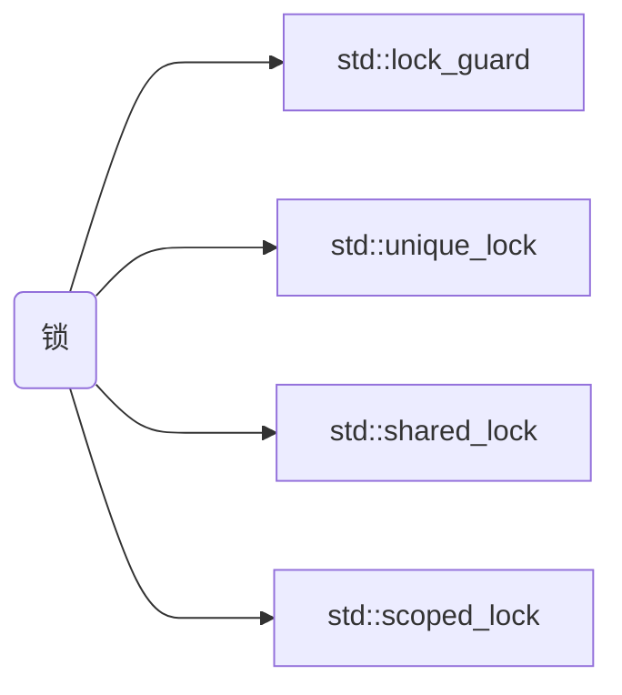

```cardlink
url: https://blog.csdn.net/iuices/article/details/123173966
title: "C++多线程：锁管理(lock)_c++ lock-CSDN博客"
description: "文章浏览阅读1.2w次，点赞14次，收藏63次。对于多线程，无法避免要使用到锁对共享资源的保护，这一节我们就来学习现代C++对于锁的管理(lock)，上一节我们已经学习了现代C++对应的mutex，直到C++17，一共有六种类型。而今天学习的锁管理，与mutex息息相关，它们都是使用RAII风格来进行锁管理，主要有下面几种：std::lock_guard(C++11)std::unique_lock(C++11)std::share_lock(C++14)std::scoped_lock(C++17)首先来简单解释一下RAII这个名称的意思：❝「RAII_c++ lock"
host: blog.csdn.net
```



>[!info] 约定
>```cpp
>struct Foo {
>	std::mutex _data1_mtx;
>	std::mutex _data2_mtx;
>	int        _data1;
>	float      _data2;
>};
>```

## 锁策略

| 锁策略               | 所有权                        | 行为                     |
| ----------------- | -------------------------- | ---------------------- |
| 默认                | 持有 mutex 所有权               | 构造锁时直接调用 `.lock()`     |
| `std::defer_lock` | 不持有 mutex 所有权              | 不调用 `.lock()`，手动延后调用   |
| `std::try_lock`   | 尝试持有 mutex 所有权，不阻塞         | 构造锁时直接调用 `.try_lock()` |
| `std::adopt_lock` | 借用 mutex 所有权，假设 mutex 已被占有 | 不调用 `.lock()`          |

## lock_guard

最简单的 lock，最纯粹的 raii 风味

```cpp
void Foo::foo() {
	std::lock_guard lock { _data1_mtx };
	_data1 = 2;                  // read
	std::cout << _data1 << "\n"; // write
	// auto unlock from `~lock_guard()`
}
```

>[!note] 多锁死锁
>
>考虑这种情况
>
>```cpp
>void Foo::foo1() {
>	std::lock_guard lock1 { _data1_mtx };
>	std::lock_guard lock2 { _data2_mtx }; // dead lock
>	_data1 = _data2 + 0.805f;
>}
>
>void Foo::foo2() {
>	std::lock_guard lock2 { _data2_mtx };
>	std::lock_guard lock1 { _data1_mtx }; // dead lock
>	_data2 = _data1 + 907;
>}
>
>void Foo::foo() {
>	auto thread1 = std::jthread { [this] { foo1(); } };
>	auto thread2 = std::jthread { [this] { foo2(); } };
>}
>```
>
>因为 `foo1()` 第一时间锁了 `_data1_mtx` 而 `foo2()` 第一时间锁了 `_data2_mtx`
>所以当两者几乎同时执行到自己的第二行时，都已经先被对方锁了，造成了死锁
>解决方法应使用 [lock](%E9%94%81.md#lock) 或者 [scoped_lock](%E9%94%81.md#scopedlock)(C++17)

## unique_lock

[lock_guard](%E9%94%81.md#lockguard) 升级版

- [ ] TODO: 完成 [unique_lock](%E9%94%81.md#uniquelock) 📅 2025-04-06 

## lock

同时锁多个 lock

```cpp
void Foo::foo() {
	std::unique_lock lock1 { _data1_mtx, std::defer_lock };
	std::unique_lock lock2 { _data2_mtx, std::defer_lock };
	std::lock(lock1, lock2);
	_data1 = _data2 + 0.805f;
}
```

## shared_lock

ISO 官方读写锁

>[!info] 多线程の读写安全
>
>主流的安全模型 (inc. rust) 认为
>- 同时一写无读
>- 同时无写多读
>
>是安全的

由多线程の的读写安全可知

| 方法                                | 保护操作   | mutex 所有权 |
| --------------------------------- | ------ | --------- |
| `lock_shared()`/`unlock_shared()` | **多读** | 被多个读线程锁持有 |
| `lock()`/`unlock()`               | **一写** | 被一个写线程锁持有 |

## scoped_lock

C++17 带来的多锁 quality-of-life 工具

对比一下 `std::lock`

```cpp
// std::lock
void Foo::foo_lock() {
	std::unique_lock lock1 { _data1_mtx, std::defer_lock };
	std::unique_lock lock2 { _data2_mtx, std::defer_lock };
	std::lock(lock1, lock2);
	_data1 = _data2 + 0.805f;
}
```

vs.

```cpp
// std::scoped_lock
void Foo::foo_scoped_lock() {
	std::scoped_lock lock { _data1_mtx, _data2_mtx };
	_data1 = _data2 + 0.805f;
}
```

## 最佳实践

### mm 原则

因为有时候对象的读操作应该对外只要求 `const&` 

但是锁 mutex 操作需要 mutex 非 `const`

所以建议对所有需要对外提供读操作的 mutex 加上 `mutable` 标签

```cpp
class Foo {
public:
	int get_data() const {
		std::scoped_lock lock { _mtx };
		return _data;
	}

private:
	// ...
	mutable std::mutex _mtx;
	int _data;
};
```

