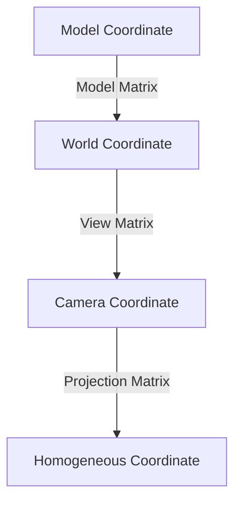

```cardlink
url: https://www.opengl-tutorial.org/beginners-tutorials/tutorial-3-matrices/
title: "Tutorial 3: Matrices"
description: "Free tutorials for modern Opengl (3.3 and later) in C/C++"
host: www.opengl-tutorial.org
```

## 齐次坐标

相对于三维坐标 $(x,y,z)$ 引入第四维 $(x,y,z,w)$

- 若 $w=0$ 则 $(x,y,z,0)$ 是一个**方向**
- 若 $w = 1$ 则 $(x,y,z,1)$ 是一个**位置**

引入齐次坐标主要是为了坐标变换都能表示成 $矩阵\times向量$ 的统一形式

## 坐标变换

约定已知
- 待变换向量为 $\boldsymbol{v}=(x,y,z,1)$
- 待变换方向为 $\boldsymbol{w}=(x,y,z,0)$
- 待变换坐标为 $\boldsymbol{x}=(x,y,z,w)$

### 平移变换

$$
T=\begin{bmatrix}
1 & 0 & 0 & X \\
0 & 1 & 0 & Y \\
0 & 0 & 1 & Z \\
0 & 0 & 0 & 1
\end{bmatrix}
$$

$$
T(\boldsymbol{v}) =\begin{bmatrix}
1 & 0 & 0 & X \\
0 & 1 & 0 & Y \\
0 & 0 & 1 & Z \\
0 & 0 & 0 & 1
\end{bmatrix}
\begin{bmatrix}
x \\
y \\
z \\
1
\end{bmatrix} 
 = \begin{bmatrix}
x+X \\
y+Y \\
z+Z \\
1
\end{bmatrix}
$$
$$
T(\boldsymbol{w}) =\begin{bmatrix}
1 & 0 & 0 & X \\
0 & 1 & 0 & Y \\
0 & 0 & 1 & Z \\
0 & 0 & 0 & 1
\end{bmatrix}
\begin{bmatrix}
x \\
y \\
z \\
0
\end{bmatrix}  
 =\begin{bmatrix}
x \\
y \\
z \\
0
\end{bmatrix}
$$

### 缩放变换

$$
S=\begin{bmatrix}
X & 0 & 0 & 0 \\
0 & Y & 0 & 0 \\
0 & 0 & Z & 0 \\
0 & 0 & 0 & 1
\end{bmatrix}
$$
$$
S(\boldsymbol{x})=\begin{bmatrix}
X & 0 & 0 & 0 \\
0 & Y & 0 & 0 \\
0 & 0 & Z & 0 \\
0 & 0 & 0 & 1
\end{bmatrix}
\begin{bmatrix}
x \\
y \\
z \\
w
\end{bmatrix}
=
\begin{bmatrix}
Xx \\
Yy \\
Zz \\
w
\end{bmatrix}
$$

### 旋转变换

比较复杂

```cardlink
url: https://www.opengl-tutorial.org/intermediate-tutorials/tutorial-17-quaternions/
title: "Tutorial 17 : Rotations"
description: "Free tutorials for modern Opengl (3.3 and later) in C/C++"
host: www.opengl-tutorial.org
```

旋转的实现方式有两种

| **旋转方式** | **四元数 Quaternion** | **欧拉角 Euler Angle** |
| -------- | ------------------ | ------------------- |
| 速度性能     | faster ✅           | fast                |
| 易懂性      | good               | better ✅            |
| 用途       | 引擎核心               | 用户接口                |

#### 四元数

四元数 $\boldsymbol{q}=(x,y,z,w)$ where.

```glsl
x = RotationAxis.x * sin(RotationAngle / 2) 
y = RotationAxis.y * sin(RotationAngle / 2) 
z = RotationAxis.z * sin(RotationAngle / 2) 
w = cos(RotationAngle / 2)
```


### 复合变换

最终的三种变换的复合变换为：

$$
M\boldsymbol{x}=TRS\boldsymbol{x}
$$
三种变换矩阵**顺序不可变**

## MVP Matrix



### Model Matrix

模型在其模型文件中的坐标就是初始的 **Model Coordinate**

根据 [坐标变换](MVP%E7%9F%A9%E9%98%B5.md#) 中的 [复合变换](MVP%E7%9F%A9%E9%98%B5.md#) 就可以把它变换到世界坐标系下的位置，也就是 **World Coordinate**

该变换用到的矩阵就是 **Model Matrix**


### View Matrix

再把世界坐标下的模型，通过 [复合变换](MVP%E7%9F%A9%E9%98%B5.md#) 转移到相对 camera 的坐标系下，得到 Camera Coordinate

该变换用到的矩阵就是 **View Matrix**


### Projection Matrix

再通过一个 **Project Matrix** 让物体符合人眼的视锥体视觉

| **Before**                                                       | **After**                                                        |
| ---------------------------------------------------------------- | ---------------------------------------------------------------- |
|  |  |
实现：

```cpp
// Generates a really hard-to-read matrix, but a normal, standard 4x4 matrix nonetheless
glm::mat4 projectionMatrix = glm::perspective( 
	glm::radians(FoV), // The vertical Field of View, in radians: the amount of "zoom". Think "camera lens". Usually between 90° (extra wide) and 30° (quite zoomed in) 
	4.0f / 3.0f, // Aspect Ratio. Depends on the size of your window. Notice that 4/3 == 800/600 == 1280/960, sounds familiar? 
	0.1f, // Near clipping plane. Keep as big as possible, or you'll get precision issues. 
	100.0f // Far clipping plane. Keep as little as possible. 
);
```

### 整体实现

```cpp
// Projection matrix: 45° Field of View, 4:3 ratio, display range: 0.1 unit <-> 100 units 
glm::mat4 Projection = glm::perspective(glm::radians(45.0f), (float) width / (float)height, 0.1f, 100.0f); 

// Or, for an ortho camera: 
// glm::mat4 Projection = glm::ortho(-10.0f,10.0f,-10.0f,10.0f,0.0f,100.0f); // In world coordinates 

// Camera matrix 
glm::mat4 View = glm::lookAt( glm::vec3(4,3,3), 
	// Camera is at (4,3,3), in World Space glm::vec3(0,0,0), 
	// and looks at the origin glm::vec3(0,1,0) 
	// Head is up (set to 0,-1,0 to look upside-down) );
	
// Model matrix: an identity matrix (model will be at the origin) 
glm::mat4 Model = glm::mat4(1.0f); 
	
// Our ModelViewProjection: multiplication of our 3 matrices 
glm::mat4 mvp = Projection * View * Model; 
	// Remember, matrix multiplication is the other way around
```
